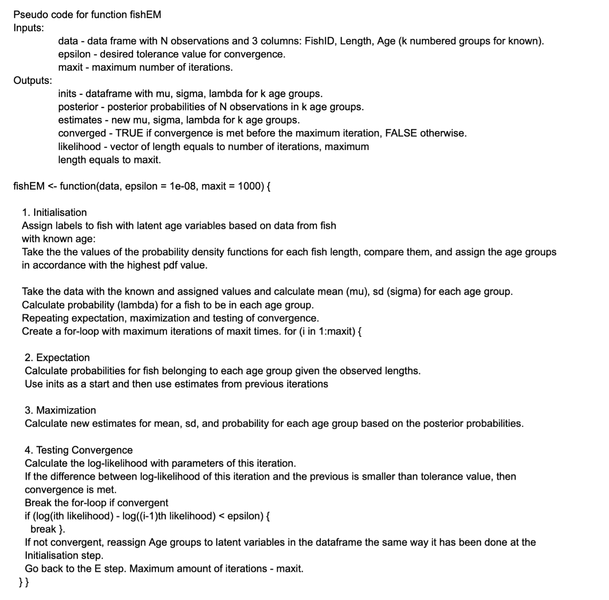

# MT4113 Assignnment

```{r , setup, include=FALSE}
knitr::opts_chunk$set(echo = TRUE)
# Libraries
library(tidyverse)
load("FishLengths.RData")
data <- x
```

# Introduction

  The data received for this project is a data frame of 1000 observations of fish with 3 types of information: ID (FishID), length of the fish (Length), and the age group they belong to (Age). 100 of the observations have been determined to belong to a known age group - 1, 2, or 3. The age group of the other 900 observations are unknown. The following are some examples of observations in FishLengths.RData and the histogram of all fish lengths.
  
  

```{r, example data from FishLengths.RData, echo = FALSE, results = "asis"}
library(knitr)
kable(data[4:9, ], caption = "First few rows from the original data frame")
```

  Since the age of a fish and its length are correlated, it is a reasonable approach to determine the age groups of fish populations by analyzing the distribution of their lengths.

```{r, Original histogram, echo = FALSE}
original_hist <- ggplot(data) +
  geom_density(aes(x = Length)) +
  geom_histogram(aes(x = Length), bins = 40) +
  xlab("Fish Length (cm)") + ylab("Density") +
  ggtitle("Original Fish Length Data Distribution") + 
  theme_minimal()
original_hist
```


  The histogram above presents 3 peaks among all fish lengths, indicating that there could be 3 main length groups and three corresponding age groups within the 1000 observations. The assumptions was that lengths within each group are normally distributed and adopt a Gaussian mixture model for the data. The research question of this project is to find estimates of the mean (mu) and standard deviation (sigma) of the normal distributions of the 3 age groups and the probability (lambda) for a fish to be in each of the groups.


# Implementation of EM algorithm

  The Expectation-Maximization (EM) algorithm was applied in order to find the most probable distribution of the age groups.^[This sentence will be printed as a footnote.] The first step is to assign the fish of unknown age into one of the age groups based on their length and the estimated parameters of the normal distributions for each age group. As a start, data from fish of known age groups are used to compute mu, sigma, and lambda for the 3 age groups. In the following iterations, estimates from the previous iterations are used. The second step is to calculate the posterior probability of a fish belonging to each age group given the observation of its length. The third step is to make new estimates of mu, sigma, and lambda based on the posterior probabilities. In the final step, a log-likelihood is calculated using the new estimates. Convergence is tested by comparing the log-likelihood of the current iteration and the previous. If the difference is smaller than a desired tolerance value, which is typically small, then convergence is met. These are the main components in a single iteration of the EM algorithm. The four steps will keep repeating until either convergence is met or reaches a maximum of iterations.

\pagebreak

# Original EM Algorithm Flow Chart

```{r flow-chart, echo = FALSE, message = FALSE, fig.align = 'center', fig.cap = 'EM Flow Chart', out.width='1.00\\linewidth'}
knitr::include_graphics("EM_flowchart.pdf")
```

\pagebreak

# Pseudo-Code

```{r pseudo-code, echo = FALSE, message = FALSE, fig.align = 'center', fig.cap = 'Pseudo-Code', out.width='0.70\\linewidth'}

```

\pagebreak
# Testing

## Initialisation Function Test

  Run two sample ks.test() to compare the initial known length values of each fish 
age group to the ones that were assigned by the initialise() function.

```{r, test_initialise(), echo = FALSE}
# Initialisation function tests
library(tidyverse)

# Load fish data
load("FishLengths.RData")

# Run two sample ks.test() to compare the initial known length values of
# each fish age group to the ones that were assigned by the initialise() 
# function.
# Input:
#  data - fish length with age groups data frame with some latent variables.
# Output:
#  result - ks.test() result whether it indicates that both groups were sampled 
# from populations with identical distributions or not.
test_initialise <- function(data) {
  # Check if the function takes in the correct arguments
  # Check if the input data is appropriate for the fishEM function: 
  # data must be data frame, have more than two rows, have values, have 3 
  # numeric Age groups, Length column should be numeric with some missing 
  # values, FishID should be a whole number.
  if (all(is.na(data)) || !is.data.frame(data) || nrow(data) < 2 || 
      !is.vector(data$Age) || !is.numeric(data$Age) || all(is.na(data$Age)) || 
      any(data$Age[!is.na(data$Age)] > 4) ||
      any(data$Age[!is.na(data$Age)] < 1) || 
      any(!data$Age[!is.na(data$Age)] %% 1 == 0) ||
      !is.vector(data$Length) || !is.numeric(data$Length) ||
      all(is.na(data$Length)) || any(is.na(data$Length)) || 
      any(data$Length <= 0) || !is.vector(data$FishID) || 
      !is.numeric(data$Length) || any(is.na(data$FishID)) || 
      any(data$FishID < 0) || any(!data$FishID %% 1 == 0)) {
    stop("invalid data argument")
  }
  
  # Initialisation function 
  # Input:
  #  data - fish length with age groups data frame with some latent variables.
  # Output:
  #  inits - data frame with initial mu, sigma and lambda values for each of the 
  # age groups in the fish data.
  #  assigned_1 - vector with fish lengths from assigned age group 1.
  #  assigned_2 - vector with fish lengths from assigned age group 2.
  #  assigned_3 - vector with fish lengths from assigned age group 3.
  initialise <- function(data) {
    
    # Extract information from the original data
    # Save the original fish length vectors by age groups
    lengths_1 <- data$Length[data$Age == 1]
    lengths_2 <- data$Length[data$Age == 2]
    lengths_3 <- data$Length[data$Age == 3]
    
    # Pre-initialise.
    # Subset the groups with known age values.
    age1_known <- filter(data, Age == 1)
    age2_known <- filter(data, Age == 2)
    age3_known <- filter(data, Age == 3)
    
    # Compute the mean and standard deviation values for each of known age groups
    summ_age1 <- summarise(age1_known, mean(Length), sd(Length))
    summ_age2 <- summarise(age2_known, mean(Length), sd(Length))
    summ_age3 <- summarise(age3_known, mean(Length), sd(Length))
    
    # Separate the latent data
    unknown <- filter(data, is.na(data$Age))
    
    # Find the probability density functions for each of the unknown age groups
    p1 <- dnorm(unknown$Length, mean = summ_age1[1, 1], sd = summ_age1[1, 2])
    p2 <- dnorm(unknown$Length, mean = summ_age2[1, 1], sd = summ_age2[1, 2])
    p3 <- dnorm(unknown$Length, mean = summ_age3[1, 1], sd = summ_age3[1, 2])
    
    # First compare the probability of the Length value belonging to each age 
    # group, then assign the age value 1, 2 or 3
    unknown$Age[p1 >= p2 & p1 > p3] <- 1
    unknown$Age[p2 > p1 & p2 > p3] <- 2
    unknown$Age[p3 > p2 & p3 > p1] <- 3
    
    # Combine the data frames of the known and now assigned latent values
    data <- rbind(filter(data, !is.na(Age)), unknown)
    
    # Initialise.
    # Initial values from the Fish age distribution.
    # Data frames for each age group including both the known and the assigned
    # values.
    # Data frames for each age group
    age1 <- filter(data, Age == 1)
    age2 <- filter(data, Age == 2)
    age3 <- filter(data, Age == 3)
    
    # Find means of each age group
    mu_x <- aggregate(data$Length, by = list(data$Age), FUN = mean)
    mu1 <- mu_x[1, 2]
    mu2 <- mu_x[2, 2]
    mu3 <- mu_x[3, 2]
    
    # Find variances of each age group
    var_x <- aggregate(data$Length, by = list(data$Age), FUN = var)
    
    # Find standard deviation of each age group
    sigma_x <- aggregate(data$Length, by = list(data$Age), FUN = sd)
    
    # Total number of fish data
    n <- nrow(data)
    
    # Calculate initial probabilities
    lambda_x <- c((nrow(age1) / n), (nrow(age2) / n), (nrow(age3) / n))
    lambda1 <- lambda_x[1]
    lambda2 <- lambda_x[2]
    lambda3 <- lambda_x[3]
    
    # Create data frame with initial values for the output
    inits <- data.frame(mu = c(mu_x[1, 2], mu_x[2, 2], mu_x[3, 2]),
                        sigma = c(sigma_x[1, 2], sigma_x[2, 2], sigma_x[3, 2]),
                        lambda = c(lambda_x[1], lambda_x[2], lambda_x[3]))
    rownames(inits)[1] <- "Age1"
    rownames(inits)[2] <- "Age2"
    rownames(inits)[3] <- "Age3"
    
    # Return the initial values
    # return(inits)
    
    # This part added to run the ks.test() on the data
    # Return the length vectors to later run a test
    assigned_1 <- unknown$Length[unknown$Age == 1]
    assigned_2 <- unknown$Length[unknown$Age == 2]
    assigned_3 <- unknown$Length[unknown$Age == 3]
    
    # Perform Two Sample Kolmogorov-Smirnov test for for each age group k 
    # prior and after latent variable assignment
    results_1 <- ks.test(x = lengths_1, y = assigned_1)
    results_2 <- ks.test(x = lengths_2, y = assigned_2)
    results_3 <- ks.test(x = lengths_3, y = assigned_3)
    
    # Extract the ks.test() results and check whether the assigned Fish Age 
    # groups are appropriate.
    # High p-values indicate no statistical significance in the difference 
    # of the means.
    if (results_1$p.value > 0.05 && results_2$p.value > 0.05 && 
                       results_3$p.value > 0.05) {
      result <- "Two-sample Kolmogorov-Smirnov tests don't indicate statistically significant difference in samples"
    }
    else {
      result <- ("Two-sample Kolmogorov-Smirnov tests indicate statistically significant difference in samples")
    }
    return(result)
  }
  return(initialise(data))
}

test_initialise(data = x)
```

## fishEM.r Function Test

  The fishEM() function outputs the correct data, the data converges.

```{r, test_fishEM(), echo = FALSE}
# Initialisation function tests
library(tidyverse)

#Test file for fishEM 
source('fishEM.r')

test_fishEM <- function(data, epsilon = 0.0001){
  test <- fishEM(data)
  
  #test the number of values in the posterior
  pass.test1 <- if ((nrow(test$posterior)) == 1000 & (ncol(test$posterior)) == 3) TRUE else FALSE
  print(paste("Posterior has 1000 rows and 3 columns:", pass.test1)) 
  
  #test sum of posterior probabilities
  test_post <- (rowSums(test$posterior, rep(3, 1000)) - 1) < 1e-10
  pass.test2 <- if (var(test_post) == 0 & test_post[1] == TRUE) TRUE else FALSE
  print(paste("Posterior probability for each observation adds up to 1:",
              pass.test2)) 

  #test log likelihood is epsilon different from the previous 
  pass.test3 <- (abs(test$likelihood[length(test$likelihood) - 1] - test$likelihood[length(test$likelihood)]) < epsilon)
  print(paste("Difference in (likelihood(i+1) and 
              likelihood(i) is ",abs(test$likelihood[length(test$likelihood)] - test$likelihood[length(test$likelihood) - 1]),
              "
              Is difference less than epsilon:", pass.test3))
  
  #does converge match with the what is said by epsilon 
  pass.test4 <- ((test$converge == TRUE && (abs(test$likelihood[length(test$likelihood) - 1] - test$likelihood[length(test$likelihood)]) < epsilon)) || 
                   (test$converge == FALSE && (abs(test$likelihood[length(test$likelihood) - 1] - test$likelihood[length(test$likelihood)]) >  epsilon)) )
  print(paste("Does converge output match with what is confered from difference in likelihoods: ", pass.test4))
  
  #does the output list have 5 elements 
  pass.test5 <- (length(test) == 5)
  print(paste("Correct number of outputs:", pass.test5))
  
  
}

test_fishEM(data = x)
```

## Simulation from Gaussian Mixture

As part of the testing of the fishEM function, the data was simulated from a known Gaussian mixture, implemented the fishEM function on this data and compared the estimates with the known results. 
The simulation testing function (found in file ‘Simulation_Testing.R’) takes distribution inputs from the user, creates the simulated Gaussian mixture, runs the ‘fishEM’ function on this data and evaluates the accuracy of the estimates via confidence intervals.
In order to obtain the simulated data, the function samples 1000 values from 3 different Normal distributions with means and standard deviations sourced from the inputs of the ‘simulation’ function. For the testing, means of 20, 40, 70 and standard deviations of 2, 5, 10 were used respectively. In the simulation data, 100 of the values will have known ‘Age’ data; the rest (900) of the ‘Age’ values will be ‘NA’. 


```{r, echo = FALSE}
# Simulation testing of the fishEM function

# This function is a testing function that will take distribution inputs from
# the user, create the simulated Gaussian mixture, run the fishEM function on 
# this data and evaluate the accuracy of the estimates
# Inputs : data - a data frame with 3 columns (FishID, Length, Age)
#          means - a vector of length 3 with the true means
#          sds - a vector of length 3 with the true standard deviations
# Outputs : A statement detailing no of iterations
#           A statement detailing the true values, estimated values and 
#             confidence intervals

  # Sourcing the code from the Working File
  source("~/Desktop/Projects for Applications/Fish-Weight/fishEM.R")

  # Test code with known values
  data <- x
  means <- c(20, 40, 70)
  sds <- c(2, 5, 10)
  # Checks for the input; the data input should have checks from the fishEM func
  if (!is.vector(means) || !is.vector(sds) || 
      length(means) != 3 || length(sds) != 3 || 
      any(means < 0) || any(sds < 0)) {
    stop("invalid input argument")
  }
  
  # Simulating data from 3 different Gaussian distributions
  sim_1 <- rnorm(1000, mean = means[1], sd = sds[1])
  sim_2 <- rnorm(1000, mean = means[2], sd = sds[2])
  sim_3 <- rnorm(1000, mean = means[3], sd = sds[3])
  
  # Combining the above vectors into a dataframe and allocating the known ages
  Age = c(rep(1, times = 1000), rep(2, times = 1000), rep(3, times = 1000))
  sim_tot <- data.frame(Length = c(sim_1, sim_2, sim_3),
                        Age = Age )
  
  # Random sampling 1000 values from the above vector for the Gaussian mixture
  sim_rand <- sim_tot[sample(nrow(sim_tot), 1000),]
  
  # Viewing the sample as a histogram
  ggplot() +
    geom_histogram(aes(x = sim_rand$Length), bins = 20) +
    xlab("Fish Length (cm)") + ylab("Density") +
    ggtitle("Simulated from Gaussian Mixture Fish Length Data Distribution") + 
    xlim(c(0, 120)) +
    theme_minimal()
  
  
  # Creating the initial data frame for the fishEM function
  FishID = 1:1000
  test_dat <- data.frame(FishID = FishID, 
                         Length = sim_rand$Length, 
                         Age = sim_rand$Age)
  
  # Allocating unknown values to 900 fish lengths
  chosen <- sample(1:1000, 900)
  test_dat$Age[chosen] <- NA
  
  # Re-checking how many values allocated
  known <- test_dat[!(is.na(test_dat$Age)), ]
  nrow(known)
  
  ggplot(known) +
    geom_density(aes(x = Length)) +
    geom_histogram(aes(x = Length), bins = 20) +
    xlab("Fish Length (cm)") + ylab("Density") +
    ggtitle("Known Length Data Distribution") + 
    theme_minimal()
  
  # Testing the function for the above data and finding confidence intervals
  # for the means of each age group
  test_results <- fishEM(test_dat)
  
  # Extracting the estimates, calc. standard error and margin error
  test_est <- test_results$estimates
  std_error <- test_est$sigma / sqrt(length(test_dat$Length))
  alpha = 0.05
  norm = qnorm(alpha/2, mean = test_est$mu, sd = test_est$sigma)
  m_error <- std_error * norm
  
  
  # Calculating the bounds for each age group
  ci_lower <- test_est$mu - m_error
  ci_upper <- test_est$mu + m_error
  
  # Printing out final statement
  # print(paste("The values for the gaussian mixture are mu =",
  #             means[1], ",", means[2], ",", means[3], "with sd = 2, 5, 10.",
  # "The EM algorithm produced means of mu =",round(test_est$mu[1], 2),
  # ",", round(test_est$mu[2], 2), ",", round(test_est$mu[3], 2), ".",
  # "Hence, the confidence intervals for the means are (", round(ci_lower[1], 2), ",", 
  # round(ci_upper[1], 2), ")", ", (", round(ci_lower[2], 2), ",",
  # round(ci_upper[2], 2), ")", ", (", round(ci_lower[3], 2), ",",
  # round(ci_upper[3], 2), ")"))

```


The simulated data has 3 distinct peaks (much like the FishLengths.RData file) with each peak having a different standard deviation. The next step was running the fishEM function on the simulated data which had the following outputs:

simulation(data, means = c(20, 40, 70), sds = c(2, 5, 10))

[1] "No of iterations is  78"
[1] "The values for the gaussian mixture are mu = 20 , 40 , 70 with sd = 2, 5, 10. The EM algorithm produced means of mu = 22.19 , 41 , 66.82 . Hence, the confidence intervals for the means are ( 20.56 , 23.81 ) , ( 36.19 , 45.81 ) , ( 51.37 , 82.28 )"

The user will be able to use this to evaluate if the true means lie in the confidence intervals. 
Please note: since the seed has not been set in this function, the estimates do change on every re-run. In this testing example, the ‘fishEM’  function took 78 iterations to converge to the means with a system time of 0.68 seconds.


# Results

```{r, Results, echo = FALSE, results = "asis"}
# Loading of fish data
load("FishLengths.RData")
data <- x


# Expectation-Maximization Algorithm Manually

fishEM <- function(data, epsilon = 1e-08, maxit = 1000) {

  # Check if the input data is appropriate for the fishEM function: 
  # data must be data frame, have more than two rows, have values, have 3 
  # numeric Age groups, Length column should be numeric with some missing 
  # values, FishID should be a whole number
  
  if (all(is.na(data)) || !is.data.frame(data) || nrow(data) < 2 || 
      !is.vector(data$Age) || !is.numeric(data$Age) || all(is.na(data$Age)) || 
      any(data$Age[!is.na(data$Age)] > 4) || 
      any(data$Age[!is.na(data$Age)] < 1) || 
      any(!data$Age[!is.na(data$Age)] %% 1 == 0) ||
      !is.vector(data$Length) || !is.numeric(data$Length) || 
      all(is.na(data$Length)) || 
      any(data$Length <= 0) || 
      !is.vector(data$FishID) || 
      !is.numeric(data$Length) || any(is.na(data$FishID)) || 
      any(data$FishID < 0) || any(!data$FishID %% 1 == 0)) {
    stop("invalid data argument")
  }
  
  # Check if the epsilon is left as the default 1e-08
  if (!is.numeric(epsilon) || !is.vector(epsilon) || 
      length(epsilon) > 1 || epsilon < 0) {
    stop("invalid epsilon argument")
  }
  
  # Check if the value maxit is a single numeric whole number, greater than 0.
  if (!is.numeric(maxit) || !is.vector(maxit) || 
      length(maxit) > 1 || !maxit %% 1 == 0 || maxit < 1) {
    stop("invalid maxit argument")
  }
  
  #divide the data into known and unknow fish ages 
  known <- x[!(is.na(x$Age)), ]
  unknown <- x[(is.na(x$Age)), ]
  
  # Vector created to store likelihood values, will have max length 1000
  likelihood <- rep(NA, times = 1000)
  
  # Reset of counter to record number of iterations run
  counter <- 0
  
  
  # 1. Initialisation
  
  
  # Pre-initialise.
  # Subset the groups with known age values.
  age1_known <- filter(data, Age == 1)
  age2_known <- filter(data, Age == 2)
  age3_known <- filter(data, Age == 3)
  
  # Compute the mean and standard deviation values for each of known age groups
  summ_age1 <- summarise(age1_known, mean(Length), sd(Length))
  summ_age2 <- summarise(age2_known, mean(Length), sd(Length))
  summ_age3 <- summarise(age3_known, mean(Length), sd(Length))
  
  # Separate the latent data
  unknown <- filter(data, is.na(data$Age))
  
  # Find the probability density functions for each of the unknown age groups
  p1 <- dnorm(unknown$Length, mean = summ_age1[1, 1], sd = summ_age1[1, 2])
  p2 <- dnorm(unknown$Length, mean = summ_age2[1, 1], sd = summ_age2[1, 2])
  p3 <- dnorm(unknown$Length, mean = summ_age3[1, 1], sd = summ_age3[1, 2])
  
  # First compare the probability of the Length value belonging to each age 
  # group, then assign the value 1, 2 or 3
  unknown$Age[p1 >= p2 & p1 > p3] <- 1
  unknown$Age[p2 > p1 & p2 > p3] <- 2
  unknown$Age[p3 >= p2 & p3 > p1] <- 3
  
  # Combine the data frames of the known and now assigned latent values
  data <- rbind(filter(data, !is.na(Age)), unknown)
  
  y <- data$Length
  
  # Initialise.
  # Initial values from the Fish age distribution.
  # Data frames for each age group including both the known and the assigned
  # values.
  # Data frames for each age group
  age1 <- filter(data, Age == 1)
  age2 <- filter(data, Age == 2)
  age3 <- filter(data, Age == 3)
  
  # Find means of each age group
  mu_x <- aggregate(data$Length, by = list(data$Age), FUN = mean)
  
  # Find variances of each age group
  var_x <- aggregate(data$Length, by = list(data$Age), FUN = var)
  
  # Find standard deviation of each age group
  sigma_x <- aggregate(data$Length, by = list(data$Age), FUN = sd)
  
  # Total number of fish data
  n <- nrow(data)
  
  # Calculate initial probabilities
  lambda_x <- c((nrow(age1) / n), (nrow(age2) / n), (nrow(age3) / n))
  
  
  # Create data frame with initial values for the output
  inits <- data.frame(mu = c(mu_x[1, 2], mu_x[2, 2], mu_x[3, 2]),
                      sigma = c(sigma_x[1, 2], sigma_x[2, 2], sigma_x[3, 2]),
                      lambda = c(lambda_x[1], lambda_x[2], lambda_x[3]),
                      row.names = c('Age1', 'Age2', 'Age3'))
  
  
  # 2. Expectation
  
  # Create for-loop with maximum iterations of maxit times
  for (i in 1 : maxit) {  
    
    # Check if estimations from previous iteration exists.
    # If not then use the initial data.
    if (counter == 0){
      estimates <- inits
    } else {
      estimates <- estimates 
    }
    
    
    
    # Numerators and denominators for conditional probabilities
    num1 <- dnorm(y, estimates[1, 1], estimates[1, 2]) * 
      estimates[1, 3]
    num2 <- dnorm(y, estimates[2, 1], estimates[2, 2]) * 
      estimates[2, 3]
    num3 <- dnorm(y, estimates[3, 1], estimates[3, 2]) * 
      estimates[3, 3]
    den <- mapply(sum, num1, num2, num3)
    
    # Posterior probabilities for observations belonging to age group 1
    post1 <- num1 / den
    # Posterior probabilities for observations belonging to age group 2
    post2 <- num2 / den
    # Posterior probabilities for observations belonging to age group 3
    post3 <- num3 / den
    
    # Create dataframe with posterior probabilities
    posterior <- data.frame(Age1 = post1, Age2 = post2, Age3 = post3)
    
    
    
    # 3. Maximization 
    
    
    #takes the values from the expectation step and computes the new mean and variance 
    
    # this is the same as the transpose of the output from post_prob
    post_matrix <- t(as.matrix(posterior))
    
    # for new means
    num_mu_mat <- post_matrix %*% data$Length
    din_mat <- rowSums(post_matrix)
    #new estimated means for this iteration 
    maximized_mu_mat <- num_mu_mat/din_mat
    
    # for new variances
    sq_mat <- cbind(y - maximized_mu_mat[1,1], 
                    y - maximized_mu_mat[2,1], 
                    y - maximized_mu_mat[3,1])
    
    num_sigma_mat <- post_matrix %*% (sq_mat^2)
    # Here the sigma values will be on the diagonal, extracting below -
    num_sigma <- rbind(num_sigma_mat[1,1], 
                       num_sigma_mat[2,2], 
                       num_sigma_mat[3,3])
    
    #new estimated sigma for this iteration 
    maximized_sigma_mat_sq3 <- sqrt(num_sigma/din_mat)
    
    #new estimated lambda for this iteration 
    maximized_lambda_mat <- (1/n) * din_mat
    
    #data frame of maximized values
    estimates <- data.frame(mu = c(maximized_mu_mat), sigma = c(maximized_sigma_mat_sq3), 
                            lambda = maximized_lambda_mat)
    
    rownames(estimates) <- c('Age1', 'Age2', 'Age3')
    
    # 4. Testing Convergence
    
    # Vector created to store likelihood values, will have max length 1000
    
    lam_dens_1 <- maximized_lambda_mat[1] *
      dnorm(y, 
            maximized_mu_mat[1,1], 
            maximized_sigma_mat_sq3[1,1])
    
    lam_dens_2 <- maximized_lambda_mat[2] *
      dnorm(y, 
            maximized_mu_mat[2,1], 
            maximized_sigma_mat_sq3[2,1])
    
    lam_dens_3 <- maximized_lambda_mat[3] *
      dnorm(y, 
            maximized_mu_mat[3,1], 
            maximized_sigma_mat_sq3[3,1])
    
    sum_lam_dens <- lam_dens_1 + lam_dens_2 + lam_dens_3
    log_lam_dens <- log(sum_lam_dens)
    log_lik <- sum(log_lam_dens)
    options(digits = 12)

    
    # Storing the log-lik in the likelihood vector
    likelihood[counter + 1] <- log_lik
    
    # Evaluating if log-lik has converged to less than epsilon
    if (counter > 1) {
      if (abs(log_lik - likelihood[counter]) < epsilon) {
        converged <- TRUE
        likelihood <- likelihood[1 : counter]
        print(paste("No of iterations is ", counter))
        #the required list that the fishEM function should return 
        final_return <- list(estimates = estimates, inits = inits,
                             converged = converged, posterior = posterior, 
                             likelihood = likelihood)
        return(final_return)
        break
      }
    }
    
    
    
    # This step is to reassign age groups if llk hasn't converged
    # Find the probability density functions for each of the unknown age groups
    p1 <- dnorm(unknown$Length, 
                mean = maximized_mu_mat[1, 1], 
                sd = maximized_sigma_mat_sq3[1, 1])
    p2 <- dnorm(unknown$Length, 
                mean = maximized_mu_mat[2, 1], 
                sd = maximized_sigma_mat_sq3[2, 1])
    p3 <- dnorm(unknown$Length, 
                mean = maximized_mu_mat[3, 1], 
                sd = maximized_sigma_mat_sq3[3, 1])
    
    # First compare the probability of the Length value belonging to each age 
    # group, then assign the value 1, 2 or 3
    # Select data with priorly known values
    unknown$Age[p1 >= p2 & p1 > p3] <- 1
    unknown$Age[p2 > p1 & p2 > p3] <- 2
    unknown$Age[p3 >= p2 & p3 > p1] <- 3
    
    # Combine the data frames of the known and now assigned latent values
    data <- rbind(known, unknown)
    
    
    # Counter inserted to keep track of number of iterations
    counter <- counter + 1
    
    #for if the number of iterations reaches the maximum allowed as input by the user 
    if (counter == maxit){
      converge <- FALSE 
      print('Falied to converge within the max iterations given ')
      break
    }
  }
}
fishEM_res <- fishEM(data = x)

kable(fishEM_res$estimates, caption = "Estimates")
```

The results obtained from the estimates table show the estimated mean and standard deviation of the length of fish contained in each age group of fish, Age 1, Age 2 and Age 3. This means the EM algorithm calculated that the average length of fish in age group 1 was 23.11, in age group 2 was 41.81 and age group 3 was 66.86. These results are in line with the distribution of known fish lengths and therefore are a sensible set of estimates. 


## Plot

The plot show how the model fits to the original data. The three distribution curves follow the histogram trend, the fishEM algorithm works effectively.

```{r, echo = FALSE}
#Test file for fishEM 
source('fishEM.r')

test_fishEM <- function(data, epsilon = 0.0001){
  test <- fishEM(data)
  
  #test the number of values in the posterior
  pass.test1 <- if ((nrow(test$posterior)) == 1000 & (ncol(test$posterior)) == 3) TRUE else FALSE
  print(paste("Posterior has 1000 rows and 3 columns:", pass.test1)) 
  
  #test sum of posterior probabilities
  test_post <- (rowSums(test$posterior, rep(3, 1000)) - 1) < 1e-10
  pass.test2 <- if (var(test_post) == 0 & test_post[1] == TRUE) TRUE else FALSE
  print(paste("Posterior probability for each observation adds up to 1:",
              pass.test2)) 

  #test log likelihood is epsilon different from the previous 
  pass.test3 <- (abs(test$likelihood[length(test$likelihood) - 1] - test$likelihood[length(test$likelihood)]) < epsilon)
  print(paste("Difference in (likelihood(i+1) and likelihood(i) is ",abs(test$likelihood[length(test$likelihood)] - test$likelihood[length(test$likelihood) - 1]), 
              " Is difference less than epsilon:", pass.test3))
  
  #does converge match with the what is said by epsilon 
  pass.test4 <- ((test$converge == TRUE && (abs(test$likelihood[length(test$likelihood) - 1] - test$likelihood[length(test$likelihood)]) < epsilon)) || 
                   (test$converge == FALSE && (abs(test$likelihood[length(test$likelihood) - 1] - test$likelihood[length(test$likelihood)]) >  epsilon)) )
  print(paste("Does converge output match with what is confered from differnece in likelihoods: ", pass.test4))
  
  #does the output list have 5 elements 
  pass.test5 <- (length(test) == 5)
  print(paste("Correct number of outputs:", pass.test5))
  
  
}

# Plotting of output distribution on histogram to test fit
test <- fishEM(data)

ggplot(x, aes(x = Length)) + geom_histogram(binwidth = 1) +
  mapply(
    function(mean, sd, lambda, n, binwidth) {
      stat_function(
        fun = function(x) {
          # This is to account for dnorm being expressed as densities
          # while histogram is in frequency, and adjusting for the
          # amplitude
          (dnorm(x, mean = mean, sd = sd)) * n * binwidth * lambda
        }
      )
    },
    mean = test$estimates[,1], # mean
    sd = test$estimates[,2], # standard deviation
    lambda = test$estimates[,3], # lambda
    n = length(x$Length), # sample size
    binwidth = 1 # binwidth used for histogram
  ) +
  labs(x = "Length", y = "Frequency",
       title = "Plot of the estimated Gaussian mixture on its histogram")


```


\pagebreak

# Bibliography


1. Do, C.B. and S. Batzoglou. 2008. What is the expectation maximization algorithm? Nature Biotechnology 26:897-899.
